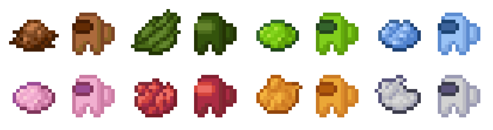

*Image generated with the demo.py script*

# susmc

This python script builds a texture pack from default minecraft textures, changing item textures to among us characters and item and block names to "Sus [name]".

It uses the colorthief library to get a color palette from textures, with sklearn to cluster them into similar colors, and applying them to the
different layers making up the among us character.

**The texture pack generated from 1.16.5 is included in the release if you're not interested in the script part of the project.**

## Usage

### Windows (executable)

Get the executable from the releases tab.

Once downloaded, you can drag a minecraft version jar (found in `%appdata%\.minecraft\versions\[version]\[version].jar`) on the executable,
which will generate a zipped resourcepack in the version folder.

Alternatively, you can use the executable as a command line tool by replacing `python main.py` with `.\susmc` in commands from the next section.

### All OS (command line)

Clone the repository on your machine: `git clone https://github.com/OscarGlo/susmc`

Install required dependencies (could take up to a few minutes): `python -m pip install -r requirements.txt`

Then, to create a resource pack, run `python main.py [jar_path] [destination_folder]`

To get more help on the usage of this command line tool, run `python main.py --help`.
